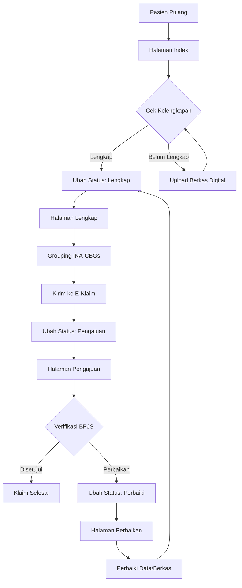

# Dokumentasi Pengambilan Data Billing Vedika

Dokumentasi lengkap mengenai proses pengambilan data billing pada modul **Vedika** (Verifikasi Digital Klaim) dalam sistem mLITE.

---

## 1. Gambaran Umum Modul Vedika

Modul Vedika berfungsi untuk:
- Mengelola klaim pasien BPJS Kesehatan
- Verifikasi kelengkapan berkas digital
- Integrasi dengan INA-CBGs (Indonesian Case Base Groups)
- Pengajuan dan perbaikan klaim

### File Utama
| File | Lokasi | Fungsi |
|------|--------|--------|
| `Admin.php` | `plugins/vedika/Admin.php` | Controller utama untuk admin (74 method) |
| `Site.php` | `plugins/vedika/Site.php` | Controller untuk user Vedika (35 method) |
| View Templates | `plugins/vedika/view/` | Template HTML untuk tampilan |

---

## 2. Tabel Database yang Digunakan

### 2.1 Tabel Utama Vedika
| Tabel | Fungsi |
|-------|--------|
| `mlite_vedika` | Menyimpan status klaim (Lengkap/Pengajuan/Perbaiki) |
| `mlite_vedika_feedback` | Log catatan/feedback perubahan status klaim |
| `mlite_users_vedika` | Pengguna khusus modul Vedika |

### 2.2 Tabel Registrasi & Pasien
| Tabel | Fungsi |
|-------|--------|
| `reg_periksa` | Data registrasi periksa pasien |
| `pasien` | Data master pasien |
| `penjab` | Penanggung jawab biaya / cara bayar |
| `dokter` | Data dokter |
| `poliklinik` | Data poliklinik |

### 2.3 Tabel BPJS
| Tabel | Fungsi |
|-------|--------|
| `bridging_sep` | Data SEP (Surat Eligibilitas Peserta) |
| `bridging_surat_pri_bpjs` | Surat Perintah Rawat Inap BPJS |
| `bpjs_prb` | Data PRB (Program Rujuk Balik) |

### 2.4 Tabel Diagnosa & Prosedur
| Tabel | Fungsi |
|-------|--------|
| `diagnosa_pasien` | Diagnosa pasien (ICD-10) |
| `prosedur_pasien` | Prosedur/tindakan pasien (ICD-9-CM) |
| `penyakit` | Master data penyakit |
| `icd9` | Master data prosedur ICD-9 |

### 2.5 Tabel Rawat Jalan
| Tabel | Fungsi |
|-------|--------|
| `rawat_jl_dr` | Tindakan rawat jalan oleh dokter |
| `rawat_jl_pr` | Tindakan rawat jalan oleh perawat |
| `rawat_jl_drpr` | Tindakan rawat jalan dokter-perawat |
| `jns_perawatan` | Master jenis perawatan rawat jalan |
| `pemeriksaan_ralan` | Data pemeriksaan rawat jalan |

### 2.6 Tabel Rawat Inap
| Tabel | Fungsi |
|-------|--------|
| `rawat_inap_dr` | Tindakan rawat inap oleh dokter |
| `rawat_inap_pr` | Tindakan rawat inap oleh perawat |
| `rawat_inap_drpr` | Tindakan rawat inap dokter-perawat |
| `jns_perawatan_inap` | Master jenis perawatan rawat inap |
| `kamar_inap` | Data kamar inap pasien |
| `kamar` | Master data kamar |
| `bangsal` | Master data bangsal |
| `dpjp_ranap` | DPJP rawat inap |
| `pemeriksaan_ranap` | Data pemeriksaan rawat inap |

### 2.7 Tabel Penunjang Medis
| Tabel | Fungsi |
|-------|--------|
| `periksa_lab` | Pemeriksaan laboratorium |
| `jns_perawatan_lab` | Master jenis perawatan lab |
| `detail_periksa_lab` | Detail hasil lab |
| `template_laboratorium` | Template laboratorium |
| `periksa_radiologi` | Pemeriksaan radiologi |
| `jns_perawatan_radiologi` | Master jenis perawatan radiologi |
| `hasil_radiologi` | Hasil radiologi |
| `gambar_radiologi` | Gambar hasil radiologi |

### 2.8 Tabel Farmasi & Obat
| Tabel | Fungsi |
|-------|--------|
| `detail_pemberian_obat` | Pemberian obat ke pasien |
| `databarang` | Master data barang/obat |
| `resep_pulang` | Resep obat pulang |
| `beri_obat_operasi` | Obat/BHP operasi |
| `obatbhp_ok` | Master obat/BHP OK |

### 2.9 Tabel Operasi
| Tabel | Fungsi |
|-------|--------|
| `operasi` | Data operasi pasien |
| `paket_operasi` | Master paket operasi |
| `laporan_operasi` | Laporan operasi |

### 2.10 Tabel Berkas Digital
| Tabel | Fungsi |
|-------|--------|
| `berkas_digital_perawatan` | Berkas digital per rawat |
| `master_berkas_digital` | Master jenis berkas digital |

### 2.11 Tabel Lainnya
| Tabel | Fungsi |
|-------|--------|
| `resume_pasien` | Resume medis rawat jalan |
| `resume_pasien_ranap` | Resume medis rawat inap |
| `tambahan_biaya` | Biaya tambahan |
| `billing` | Tabel billing (optional, khusus SIMRS tertentu) |
| `mlite_billing` | Billing bawaan mLITE |
| `kategori_perawatan` | Kategori perawatan untuk mapping INA-CBGs |

---

## 3. Pengambilan Data Index (Daftar Pasien)

### 3.1 Method `anyIndex()` - Halaman Index
**Lokasi**: `Admin.php` baris 163-396

#### Query Rawat Jalan (Ralan)
```sql
-- Total Records (Pagination)
SELECT reg_periksa.no_rawat 
FROM reg_periksa, pasien, penjab 
WHERE reg_periksa.no_rkm_medis = pasien.no_rkm_medis 
  AND reg_periksa.kd_pj = penjab.kd_pj 
  AND penjab.kd_pj IN ('{carabayar}') 
  AND (reg_periksa.no_rkm_medis LIKE ? 
       OR reg_periksa.no_rawat LIKE ? 
       OR pasien.nm_pasien LIKE ?) 
  AND reg_periksa.tgl_registrasi BETWEEN '{start_date}' AND '{end_date}' 
  AND reg_periksa.status_lanjut = 'Ralan' 
  AND reg_periksa.no_rawat NOT IN (SELECT no_rawat FROM mlite_vedika)

-- Data Detail dengan Pagination
SELECT reg_periksa.*, pasien.*, dokter.nm_dokter, poliklinik.nm_poli, penjab.png_jawab 
FROM reg_periksa, pasien, dokter, poliklinik, penjab 
WHERE reg_periksa.no_rkm_medis = pasien.no_rkm_medis 
  AND reg_periksa.kd_dokter = dokter.kd_dokter 
  AND reg_periksa.kd_poli = poliklinik.kd_poli 
  AND reg_periksa.kd_pj = penjab.kd_pj 
  AND penjab.kd_pj IN ('{carabayar}') 
  AND (reg_periksa.no_rkm_medis LIKE ? 
       OR reg_periksa.no_rawat LIKE ? 
       OR pasien.nm_pasien LIKE ?) 
  AND reg_periksa.tgl_registrasi BETWEEN '{start_date}' AND '{end_date}' 
  AND reg_periksa.status_lanjut = 'Ralan' 
  AND reg_periksa.no_rawat NOT IN (SELECT no_rawat FROM mlite_vedika) 
LIMIT {perpage} OFFSET {offset}
```

#### Query Rawat Inap (Ranap)
```sql
-- Total Records
SELECT reg_periksa.no_rawat 
FROM reg_periksa, pasien, penjab, kamar_inap 
WHERE reg_periksa.no_rkm_medis = pasien.no_rkm_medis 
  AND reg_periksa.no_rawat = kamar_inap.no_rawat 
  AND reg_periksa.kd_pj = penjab.kd_pj 
  AND penjab.kd_pj IN ('{carabayar}') 
  AND (reg_periksa.no_rkm_medis LIKE ? 
       OR reg_periksa.no_rawat LIKE ? 
       OR pasien.nm_pasien LIKE ?) 
  AND kamar_inap.tgl_keluar BETWEEN '{start_date}' AND '{end_date}' 
  AND reg_periksa.status_lanjut = 'Ranap'

-- Data Detail
SELECT reg_periksa.*, pasien.*, dokter.nm_dokter, poliklinik.nm_poli, 
       penjab.png_jawab, kamar_inap.tgl_keluar, kamar_inap.jam_keluar, kamar_inap.kd_kamar 
FROM reg_periksa, pasien, dokter, poliklinik, penjab, kamar_inap 
WHERE reg_periksa.no_rkm_medis = pasien.no_rkm_medis 
  AND reg_periksa.no_rawat = kamar_inap.no_rawat 
  AND reg_periksa.kd_dokter = dokter.kd_dokter 
  AND reg_periksa.kd_poli = poliklinik.kd_poli 
  AND reg_periksa.kd_pj = penjab.kd_pj 
  AND penjab.kd_pj IN ('{carabayar}') 
  AND kamar_inap.tgl_keluar BETWEEN '{start_date}' AND '{end_date}' 
  AND reg_periksa.status_lanjut = 'Ranap' 
LIMIT {perpage} OFFSET {offset}
```

#### Data Tambahan Per Baris
Untuk setiap record, sistem mengambil data tambahan:

```php
// Berkas Digital Perawatan
$berkas_digital = $this->core->mysql('berkas_digital_perawatan')
  ->join('master_berkas_digital', 'master_berkas_digital.kode=berkas_digital_perawatan.kode')
  ->where('berkas_digital_perawatan.no_rawat', $row['no_rawat'])
  ->asc('master_berkas_digital.nama')
  ->toArray();

// Informasi SEP
$row['no_sep'] = $this->_getSEPInfo('no_sep', $row['no_rawat']);
$row['no_peserta'] = $this->_getSEPInfo('no_kartu', $row['no_rawat']);
$row['no_rujukan'] = $this->_getSEPInfo('no_rujukan', $row['no_rawat']);

// Diagnosa Utama (Prioritas 1)
$row['kd_penyakit'] = $this->_getDiagnosa('kd_penyakit', $row['no_rawat'], $row['status_lanjut']);
$row['nm_penyakit'] = $this->_getDiagnosa('nm_penyakit', $row['no_rawat'], $row['status_lanjut']);

// Prosedur Utama (Prioritas 1)
$row['kode'] = $this->_getProsedur('kode', $row['no_rawat'], $row['status_lanjut']);
$row['deskripsi_panjang'] = $this->_getProsedur('deskripsi_panjang', $row['no_rawat'], $row['status_lanjut']);

// Status Pengajuan
$row['status_pengajuan'] = $this->core->mysql('mlite_vedika')
  ->where('nosep', $this->_getSEPInfo('no_sep', $row['no_rawat']))
  ->desc('id')
  ->limit(1)
  ->toArray();
```

---

### 3.2 Method `anyLengkap()` - Status Lengkap
**Lokasi**: `Admin.php` baris 398-627

```sql
-- Rawat Jalan
SELECT * FROM mlite_vedika 
WHERE status = 'Lengkap' 
  AND jenis = '2' 
  AND (no_rkm_medis LIKE ? OR no_rawat LIKE ? OR nosep LIKE ?) 
  AND tgl_registrasi BETWEEN '{start_date}' AND '{end_date}' 
ORDER BY nosep ASC 
LIMIT {perpage} OFFSET {offset}

-- Rawat Inap
SELECT * FROM mlite_vedika 
WHERE status = 'Lengkap' 
  AND jenis = '1' 
  AND (no_rkm_medis LIKE ? OR no_rawat LIKE ? OR nosep LIKE ?) 
  AND no_rawat IN (SELECT no_rawat FROM kamar_inap WHERE tgl_keluar BETWEEN '{start_date}' AND '{end_date}')
ORDER BY mlite_vedika.nosep 
LIMIT {perpage} OFFSET {offset}
```

> **Catatan**: `jenis = '2'` untuk Rawat Jalan, `jenis = '1'` untuk Rawat Inap

---

### 3.3 Method `anyPengajuan()` - Status Pengajuan
**Lokasi**: `Admin.php` baris 629-857

```sql
-- Rawat Jalan
SELECT * FROM mlite_vedika 
WHERE status = 'Pengajuan' 
  AND jenis = '2' 
  AND (no_rkm_medis LIKE ? OR no_rawat LIKE ? OR nosep LIKE ?) 
  AND tgl_registrasi BETWEEN '{start_date}' AND '{end_date}' 
ORDER BY nosep 
LIMIT {perpage} OFFSET {offset}

-- Rawat Inap
SELECT * FROM mlite_vedika 
WHERE status = 'Pengajuan' 
  AND jenis = '1' 
  AND (no_rkm_medis LIKE ? OR no_rawat LIKE ? OR nosep LIKE ?) 
  AND no_rawat IN (SELECT no_rawat FROM kamar_inap WHERE tgl_keluar BETWEEN '{start_date}' AND '{end_date}')
ORDER BY mlite_vedika.nosep 
LIMIT {perpage} OFFSET {offset}
```

---

### 3.4 Method `anyPerbaikan()` - Status Perbaikan
**Lokasi**: `Admin.php` baris 982-1203

```sql
-- Rawat Jalan
SELECT * FROM mlite_vedika 
WHERE status = 'Perbaiki' 
  AND jenis = '2' 
  AND (no_rkm_medis LIKE ? OR no_rawat LIKE ? OR nosep LIKE ?) 
  AND tgl_registrasi BETWEEN '{start_date}' AND '{end_date}' 
ORDER BY nosep 
LIMIT {perpage} OFFSET {offset}

-- Rawat Inap
SELECT * FROM mlite_vedika 
WHERE status = 'Perbaiki' 
  AND jenis = '1' 
  AND (no_rkm_medis LIKE ? OR no_rawat LIKE ? OR nosep LIKE ?) 
  AND no_rawat IN (SELECT no_rawat FROM kamar_inap WHERE tgl_keluar BETWEEN '{start_date}' AND '{end_date}')
ORDER BY mlite_vedika.nosep 
LIMIT {perpage} OFFSET {offset}
```

---

## 4. Pengambilan Data Billing Detail

### 4.1 Method `getPDF()` - Detail Billing Lengkap
**Lokasi**: `Admin.php` baris 1429-1885

Method ini mengambil semua data billing untuk ditampilkan dalam format PDF.

#### 4.1.1 Pengecekan Tabel Billing SIMRS
```php
// Cek apakah ada tabel 'billing' (SIMRS tertentu)
$check_billing = $this->core->mysql()->pdo()->query("SHOW TABLES LIKE 'billing'");

if($check_billing) {
    // Jika ada tabel billing
    $query = "SELECT no, nm_perawatan, pemisah, 
                     if(biaya=0,'',biaya),
                     if(jumlah=0,'',jumlah),
                     if(tambahan=0,'',tambahan),
                     if(totalbiaya=0,'',totalbiaya), totalbiaya 
              FROM billing 
              WHERE no_rawat='{no_rawat}'";
}
```

#### 4.1.2 Billing mLITE - Rawat Jalan
Jika setting `vedika.billing = 'mlite'`:

```php
// Header Billing
$result_detail['billing'] = $this->core->mysql('mlite_billing')
  ->where('no_rawat', $no_rawat)
  ->like('kd_billing', 'RJ%')
  ->desc('id_billing')
  ->oneArray();

// Poliklinik
$result_detail['poliklinik'] = $this->core->mysql('poliklinik')
  ->join('reg_periksa', 'reg_periksa.kd_poli = poliklinik.kd_poli')
  ->where('reg_periksa.no_rawat', $no_rawat)
  ->oneArray();

// Rawat Jalan - Dokter
$result_detail['rawat_jl_dr'] = $this->core->mysql('rawat_jl_dr')
  ->select('jns_perawatan.nm_perawatan')
  ->select(['biaya_rawat' => 'rawat_jl_dr.biaya_rawat'])
  ->select(['jml' => 'COUNT(rawat_jl_dr.kd_jenis_prw)'])
  ->select(['total_biaya_rawat_dr' => 'SUM(rawat_jl_dr.biaya_rawat)'])
  ->join('jns_perawatan', 'jns_perawatan.kd_jenis_prw = rawat_jl_dr.kd_jenis_prw')
  ->where('rawat_jl_dr.no_rawat', $no_rawat)
  ->group('jns_perawatan.nm_perawatan')
  ->toArray();

// Rawat Jalan - Perawat
$result_detail['rawat_jl_pr'] = $this->core->mysql('rawat_jl_pr')
  ->select('jns_perawatan.nm_perawatan')
  ->select(['biaya_rawat' => 'rawat_jl_pr.biaya_rawat'])
  ->select(['jml' => 'COUNT(rawat_jl_pr.kd_jenis_prw)'])
  ->select(['total_biaya_rawat_pr' => 'SUM(rawat_jl_pr.biaya_rawat)'])
  ->join('jns_perawatan', 'jns_perawatan.kd_jenis_prw = rawat_jl_pr.kd_jenis_prw')
  ->where('rawat_jl_pr.no_rawat', $no_rawat)
  ->group('jns_perawatan.nm_perawatan')
  ->toArray();

// Rawat Jalan - Dokter & Perawat
$result_detail['rawat_jl_drpr'] = $this->core->mysql('rawat_jl_drpr')
  ->select('jns_perawatan.nm_perawatan')
  ->select(['biaya_rawat' => 'rawat_jl_drpr.biaya_rawat'])
  ->select(['jml' => 'COUNT(rawat_jl_drpr.kd_jenis_prw)'])
  ->select(['total_biaya_rawat_drpr' => 'SUM(rawat_jl_drpr.biaya_rawat)'])
  ->join('jns_perawatan', 'jns_perawatan.kd_jenis_prw = rawat_jl_drpr.kd_jenis_prw')
  ->where('rawat_jl_drpr.no_rawat', $no_rawat)
  ->group('jns_perawatan.nm_perawatan')
  ->toArray();

// Pemberian Obat Rawat Jalan
$result_detail['detail_pemberian_obat'] = $this->core->mysql('detail_pemberian_obat')
  ->join('databarang', 'databarang.kode_brng=detail_pemberian_obat.kode_brng')
  ->where('no_rawat', $no_rawat)
  ->where('detail_pemberian_obat.status', 'Ralan')
  ->toArray();

// Pemeriksaan Lab Rawat Jalan
$result_detail['periksa_lab'] = $this->core->mysql('periksa_lab')
  ->join('jns_perawatan_lab', 'jns_perawatan_lab.kd_jenis_prw=periksa_lab.kd_jenis_prw')
  ->where('no_rawat', $no_rawat)
  ->where('periksa_lab.status', 'Ralan')
  ->toArray();

// Pemeriksaan Radiologi Rawat Jalan
$result_detail['periksa_radiologi'] = $this->core->mysql('periksa_radiologi')
  ->join('jns_perawatan_radiologi', 'jns_perawatan_radiologi.kd_jenis_prw=periksa_radiologi.kd_jenis_prw')
  ->where('no_rawat', $no_rawat)
  ->where('periksa_radiologi.status', 'Ralan')
  ->toArray();

// Operasi Rawat Jalan
$operasis = $this->core->mysql('operasi')
  ->join('paket_operasi', 'paket_operasi.kode_paket=operasi.kode_paket')
  ->where('no_rawat', $no_rawat)
  ->where('operasi.status', 'Ralan')
  ->toArray();

// Obat/BHP Operasi
$obat_operasis = $this->core->mysql('beri_obat_operasi')
  ->join('obatbhp_ok', 'obatbhp_ok.kd_obat=beri_obat_operasi.kd_obat')
  ->where('no_rawat', $no_rawat)
  ->toArray();
```

#### 4.1.3 Billing mLITE - Rawat Inap
```php
// Header Billing Rawat Inap
$result_detail['billing'] = $this->core->mysql('mlite_billing')
  ->where('no_rawat', $no_rawat)
  ->like('kd_billing', 'RI%')
  ->desc('id_billing')
  ->oneArray();

// Kamar Inap
$result_detail['kamar_inap'] = $this->core->mysql('kamar_inap')
  ->join('reg_periksa', 'reg_periksa.no_rawat = kamar_inap.no_rawat')
  ->where('reg_periksa.no_rawat', $no_rawat)
  ->oneArray();

// Rawat Inap - Dokter
$result_detail['rawat_inap_dr'] = $this->core->mysql('rawat_inap_dr')
  ->select('jns_perawatan_inap.nm_perawatan')
  ->select(['biaya_rawat' => 'rawat_inap_dr.biaya_rawat'])
  ->select(['jml' => 'COUNT(rawat_inap_dr.kd_jenis_prw)'])
  ->select(['total_biaya_rawat_dr' => 'SUM(rawat_inap_dr.biaya_rawat)'])
  ->join('jns_perawatan_inap', 'jns_perawatan_inap.kd_jenis_prw = rawat_inap_dr.kd_jenis_prw')
  ->where('rawat_inap_dr.no_rawat', $no_rawat)
  ->group('jns_perawatan_inap.nm_perawatan')
  ->toArray();

// Rawat Inap - Perawat
$result_detail['rawat_inap_pr'] = $this->core->mysql('rawat_inap_pr')
  ->select('jns_perawatan_inap.nm_perawatan')
  ->select(['biaya_rawat' => 'rawat_inap_pr.biaya_rawat'])
  ->select(['jml' => 'COUNT(rawat_inap_pr.kd_jenis_prw)'])
  ->select(['total_biaya_rawat_pr' => 'SUM(rawat_inap_pr.biaya_rawat)'])
  ->join('jns_perawatan_inap', 'jns_perawatan_inap.kd_jenis_prw = rawat_inap_pr.kd_jenis_prw')
  ->where('rawat_inap_pr.no_rawat', $no_rawat)
  ->group('jns_perawatan_inap.nm_perawatan')
  ->toArray();

// Rawat Inap - Dokter & Perawat
$result_detail['rawat_inap_drpr'] = $this->core->mysql('rawat_inap_drpr')
  ->select('jns_perawatan_inap.nm_perawatan')
  ->select(['biaya_rawat' => 'rawat_inap_drpr.biaya_rawat'])
  ->select(['jml' => 'COUNT(rawat_inap_drpr.kd_jenis_prw)'])
  ->select(['total_biaya_rawat_drpr' => 'SUM(rawat_inap_drpr.biaya_rawat)'])
  ->join('jns_perawatan_inap', 'jns_perawatan_inap.kd_jenis_prw = rawat_inap_drpr.kd_jenis_prw')
  ->where('rawat_inap_drpr.no_rawat', $no_rawat)
  ->group('jns_perawatan_inap.nm_perawatan')
  ->toArray();

// Pemberian Obat Rawat Inap
$result_detail['detail_pemberian_obat'] = $this->core->mysql('detail_pemberian_obat')
  ->join('databarang', 'databarang.kode_brng=detail_pemberian_obat.kode_brng')
  ->where('no_rawat', $no_rawat)
  ->where('detail_pemberian_obat.status', 'Ranap')
  ->toArray();

// Pemeriksaan Lab Rawat Inap
$result_detail['periksa_lab'] = $this->core->mysql('periksa_lab')
  ->join('jns_perawatan_lab', 'jns_perawatan_lab.kd_jenis_prw=periksa_lab.kd_jenis_prw')
  ->where('no_rawat', $no_rawat)
  ->where('periksa_lab.status', 'Ranap')
  ->toArray();

// Pemeriksaan Radiologi Rawat Inap
$result_detail['periksa_radiologi'] = $this->core->mysql('periksa_radiologi')
  ->join('jns_perawatan_radiologi', 'jns_perawatan_radiologi.kd_jenis_prw=periksa_radiologi.kd_jenis_prw')
  ->where('no_rawat', $no_rawat)
  ->where('periksa_radiologi.status', 'Ranap')
  ->toArray();

// Tambahan Biaya
$result_detail['tambahan_biaya'] = $this->core->mysql('tambahan_biaya')
  ->where('no_rawat', $no_rawat)
  ->toArray();

// Operasi Rawat Inap
$operasis = $this->core->mysql('operasi')
  ->join('paket_operasi', 'paket_operasi.kode_paket=operasi.kode_paket')
  ->where('no_rawat', $no_rawat)
  ->where('operasi.status', 'Ranap')
  ->toArray();
```

#### 4.1.4 Data Klinis PDF
```php
// Data SEP
$print_sep['bridging_sep'] = $this->core->mysql('bridging_sep')
  ->where('no_sep', $this->_getSEPInfo('no_sep', $no_rawat))
  ->oneArray();

// Data PRB
$print_sep['bpjs_prb'] = $this->core->mysql('bpjs_prb')
  ->where('no_sep', $this->_getSEPInfo('no_sep', $no_rawat))
  ->oneArray();

// Resume Pasien (coba rawat jalan dulu, jika kosong ambil rawat inap)
$resume_pasien = $this->core->mysql('resume_pasien')
  ->join('dokter', 'dokter.kd_dokter = resume_pasien.kd_dokter')
  ->where('no_rawat', $no_rawat)
  ->oneArray();

if(!$resume_pasien) {
    $resume_pasien = $this->core->mysql('resume_pasien_ranap')
      ->join('dokter', 'dokter.kd_dokter = resume_pasien_ranap.kd_dokter')
      ->where('no_rawat', $no_rawat)
      ->oneArray();
}

// Data Pasien dengan Alamat
$pasien = $this->core->mysql('pasien')
  ->join('kecamatan', 'kecamatan.kd_kec = pasien.kd_kec')
  ->join('kabupaten', 'kabupaten.kd_kab = pasien.kd_kab')
  ->where('no_rkm_medis', $no_rkm_medis)
  ->oneArray();

// Diagnosa Pasien
$diagnosa_pasien = $this->core->mysql('diagnosa_pasien')
  ->join('penyakit', 'penyakit.kd_penyakit = diagnosa_pasien.kd_penyakit')
  ->where('no_rawat', $no_rawat)
  ->where('diagnosa_pasien.status', 'Ralan')  // atau 'Ranap'
  ->toArray();

// Prosedur Pasien
$prosedur_pasien = $this->core->mysql('prosedur_pasien')
  ->join('icd9', 'icd9.kode = prosedur_pasien.kode')
  ->where('no_rawat', $no_rawat)
  ->toArray();

// Pemeriksaan Laboratorium dengan Detail
$rows_pemeriksaan_laboratorium = $this->core->mysql('periksa_lab')
  ->join('jns_perawatan_lab', 'jns_perawatan_lab.kd_jenis_prw=periksa_lab.kd_jenis_prw')
  ->where('no_rawat', $no_rawat)
  ->toArray();

foreach ($rows_pemeriksaan_laboratorium as $value) {
    $value['detail_periksa_lab'] = $this->core->mysql('detail_periksa_lab')
      ->join('template_laboratorium', 'template_laboratorium.id_template=detail_periksa_lab.id_template')
      ->where('detail_periksa_lab.no_rawat', $value['no_rawat'])
      ->where('detail_periksa_lab.kd_jenis_prw', $value['kd_jenis_prw'])
      ->toArray();
}

// Resep Pulang
$resep_pulang = $this->core->mysql('resep_pulang')
  ->join('databarang', 'resep_pulang.kode_brng=databarang.kode_brng')
  ->where('no_rawat', $no_rawat)
  ->toArray();

// Laporan Operasi
$laporan_operasi = $this->core->mysql('laporan_operasi')
  ->where('no_rawat', $no_rawat)
  ->oneArray();
```

---

## 5. Pengambilan Data INA-CBGs

### 5.1 Method `getBridgingInacbgs()` - Integrasi INA-CBGs
**Lokasi**: `Admin.php` baris 2405-3043

Method ini mengumpulkan semua komponen biaya untuk dikirim ke E-Klaim BPJS.

#### 5.1.1 Data Registrasi & SEP
```php
$reg_periksa = $this->core->mysql('reg_periksa')
  ->join('pasien', 'pasien.no_rkm_medis=reg_periksa.no_rkm_medis')
  ->join('poliklinik', 'poliklinik.kd_poli=reg_periksa.kd_poli')
  ->join('dokter', 'dokter.kd_dokter=reg_periksa.kd_dokter')
  ->join('penjab', 'penjab.kd_pj=reg_periksa.kd_pj')
  ->where('no_rawat', $no_rawat)
  ->oneArray();

// Vital Sign Terakhir
$pemeriksaan = $this->core->mysql('pemeriksaan_ralan')
  ->where('no_rawat', $no_rawat)
  ->limit(1)
  ->desc('tgl_perawatan')
  ->desc('jam_rawat')
  ->toArray();

$sistole = strtok($pemeriksaan[0]['tensi'], '/');
$diastole = substr($pemeriksaan[0]['tensi'], strpos($pemeriksaan[0]['tensi'], '/') + 1);
```

#### 5.1.2 Diagnosa & Prosedur untuk E-Klaim
```php
// Semua Diagnosa (digabung dengan #)
$row_diagnosa = $this->core->mysql('diagnosa_pasien')
  ->where('no_rawat', $no_rawat)
  ->asc('prioritas')
  ->toArray();

$penyakit = '';
$a_diagnosa = 1;
foreach ($row_diagnosa as $row) {
    if($a_diagnosa == 1) {
        $penyakit = $row["kd_penyakit"];
    } else {
        $penyakit = $penyakit . "#" . $row["kd_penyakit"];
    }
    $a_diagnosa++;
}
// Hasil: "J06.9#R50.9#H66.0"

// Semua Prosedur (digabung dengan #)
$row_prosedur = $this->core->mysql('prosedur_pasien')
  ->where('no_rawat', $no_rawat)
  ->asc('prioritas')
  ->toArray();

$prosedur = '';
$a_prosedur = 1;
foreach ($row_prosedur as $row) {
    if($a_prosedur == 1) {
        $prosedur = $row["kode"];
    } else {
        $prosedur = $prosedur . "#" . $row["kode"];
    }
    $a_prosedur++;
}
// Hasil: "93.94#96.56"
```

#### 5.1.3 Kategori Biaya INA-CBGs

Setiap kategori menggunakan mapping dari `kategori_perawatan` yang dikonfigurasi di setting Vedika.

##### A. Biaya Prosedur Non-Bedah
```php
// Rawat Jalan - Dokter
$biaya_non_bedah_dr = $this->core->mysql('rawat_jl_dr')
  ->select(['biaya_rawat' => 'SUM(biaya_rawat)'])
  ->join('jns_perawatan', 'jns_perawatan.kd_jenis_prw=rawat_jl_dr.kd_jenis_prw')
  ->where('jns_perawatan.kd_kategori', $this->settings->get('vedika.inacbgs_prosedur_non_bedah'))
  ->where('no_rawat', $no_rawat)
  ->toArray();

// Rawat Jalan - Perawat
$biaya_non_bedah_pr = $this->core->mysql('rawat_jl_pr')
  ->select(['biaya_rawat' => 'SUM(biaya_rawat)'])
  ->join('jns_perawatan', 'jns_perawatan.kd_jenis_prw=rawat_jl_pr.kd_jenis_prw')
  ->where('jns_perawatan.kd_kategori', $this->settings->get('vedika.inacbgs_prosedur_non_bedah'))
  ->where('no_rawat', $no_rawat)
  ->toArray();

// Rawat Jalan - Dokter & Perawat
$biaya_non_bedah_drpr = $this->core->mysql('rawat_jl_drpr')
  ->select(['biaya_rawat' => 'SUM(biaya_rawat)'])
  ->join('jns_perawatan', 'jns_perawatan.kd_jenis_prw=rawat_jl_drpr.kd_jenis_prw')
  ->where('jns_perawatan.kd_kategori', $this->settings->get('vedika.inacbgs_prosedur_non_bedah'))
  ->where('no_rawat', $no_rawat)
  ->toArray();

// Rawat Inap - Dokter, Perawat, Dokter-Perawat (sama seperti di atas tapi dari rawat_inap_*)
```

##### B. Biaya Prosedur Bedah
```php
// Sama seperti non-bedah, tapi menggunakan:
// $this->settings->get('vedika.inacbgs_prosedur_bedah')

// Plus biaya operasi
$biaya_operasi = $this->core->mysql('operasi')
  ->select(['biaya_rawat' => 'SUM(biayaoperator1 + biayaoperator2 + biayaoperator3 + 
             biayaasisten_operator1 + biayaasisten_operator2 + biayadokter_anak + 
             biayaperawaat_resusitas + biayadokter_anestesi + biayaasisten_anestesi + 
             biayabidan + biayaperawat_luar)'])
  ->where('no_rawat', $no_rawat)
  ->where('status', 'Ralan')  // atau 'Ranap'
  ->toArray();
```

##### C. Biaya Konsultasi
```php
// Biaya Registrasi Poliklinik
$biaya_poliklinik = $this->core->mysql('reg_periksa')
  ->select(['biaya_rawat' => 'SUM(registrasi)'])
  ->join('poliklinik', 'poliklinik.kd_poli=reg_periksa.kd_poli')
  ->where('no_rawat', $no_rawat)
  ->toArray();

// Tindakan dengan kategori konsultasi
// Menggunakan: $this->settings->get('vedika.inacbgs_konsultasi')
```

##### D. Biaya Tenaga Ahli
```php
// Menggunakan: $this->settings->get('vedika.inacbgs_tenaga_ahli')
```

##### E. Biaya Keperawatan
```php
$biaya_keperawatan_jl_pr = $this->core->mysql('rawat_jl_pr')
  ->select(['biaya_rawat' => 'SUM(tarif_tindakanpr)'])
  ->where('no_rawat', $no_rawat)
  ->toArray();

$biaya_keperawatan_jl_drpr = $this->core->mysql('rawat_jl_drpr')
  ->select(['biaya_rawat' => 'SUM(tarif_tindakanpr)'])
  ->where('no_rawat', $no_rawat)
  ->toArray();

// Sama untuk rawat_inap_pr dan rawat_inap_drpr
```

##### F. Biaya Penunjang
```php
$biaya_penunjang_jl_dr = $this->core->mysql('rawat_jl_dr')
  ->select(['biaya_rawat' => 'SUM(menejemen)'])
  ->where('no_rawat', $no_rawat)
  ->toArray();

// Sama untuk rawat_jl_pr, rawat_jl_drpr, rawat_inap_*
```

##### G. Biaya Radiologi
```php
$rows_periksa_radiologi = $this->core->mysql('periksa_radiologi')
  ->join('jns_perawatan_radiologi', 'jns_perawatan_radiologi.kd_jenis_prw=periksa_radiologi.kd_jenis_prw')
  ->where('no_rawat', $no_rawat)
  ->where('periksa_radiologi.status', 'Ralan')  // atau 'Ranap'
  ->toArray();

foreach ($rows_periksa_radiologi as $row) {
    $total_biaya_radiologi += $row['biaya'];
}
```

##### H. Biaya Laboratorium
```php
$rows_periksa_lab = $this->core->mysql('periksa_lab')
  ->join('jns_perawatan_lab', 'jns_perawatan_lab.kd_jenis_prw=periksa_lab.kd_jenis_prw')
  ->where('no_rawat', $no_rawat)
  ->where('periksa_lab.status', 'Ralan')  // atau 'Ranap'
  ->toArray();

foreach ($rows_periksa_lab as $row) {
    $total_biaya_laboratorium += $row['biaya'];
}
```

##### I. Biaya Rehabilitasi
```php
// Menggunakan: $this->settings->get('vedika.inacbgs_rehabilitasi')
```

##### J. Biaya Kamar/Akomodasi
```php
// Rawat Jalan
$total_biaya_kamar = $reg_periksa['biaya_reg'];

// Rawat Inap
$__get_kamar_inap = $this->core->mysql('kamar_inap')
  ->where('no_rawat', $no_rawat)
  ->limit(1)
  ->desc('tgl_keluar')
  ->toArray();

foreach ($__get_kamar_inap as $row) {
    $subtotal_biaya_kamar += $row['ttl_biaya'];
    $total_biaya_kamar = $subtotal_biaya_kamar + $reg_periksa['biaya_reg'];
}
```

##### K. Biaya Rawat Intensif
```php
// Menggunakan: $this->settings->get('vedika.inacbgs_rawat_intensif')
```

##### L. Biaya Obat
```php
$rows_pemberian_obat = $this->core->mysql('detail_pemberian_obat')
  ->join('databarang', 'databarang.kode_brng=detail_pemberian_obat.kode_brng')
  ->where('detail_pemberian_obat.no_rawat', $no_rawat)
  ->where('detail_pemberian_obat.status', 'Ralan')  // atau 'Ranap'
  ->toArray();

foreach ($rows_pemberian_obat as $row) {
    $sub_total_biaya_obat += floatval($row['total']);
}

// Plus obat operasi
$obat_operasis = $this->core->mysql('beri_obat_operasi')
  ->where('no_rawat', $no_rawat)
  ->toArray();

foreach ($obat_operasis as $obat_operasi) {
    $jumlah_total_obat_operasi += ($obat_operasi['hargasatuan'] * $obat_operasi['jumlah']);
}

$total_biaya_obat = $sub_total_biaya_obat + $jumlah_total_obat_operasi;
```

##### M. Biaya Alkes
```php
$biaya_alkes_jl_dr = $this->core->mysql('rawat_jl_dr')
  ->select(['biaya_rawat' => 'SUM(material)'])
  ->where('no_rawat', $no_rawat)
  ->toArray();

// Sama untuk rawat_jl_pr, rawat_jl_drpr, rawat_inap_*
```

##### N. Biaya BMHP (Bahan Medis Habis Pakai)
```php
$biaya_bmhp_jl_dr = $this->core->mysql('rawat_jl_dr')
  ->select(['biaya_rawat' => 'SUM(bhp)'])
  ->where('no_rawat', $no_rawat)
  ->toArray();

// Sama untuk rawat_jl_pr, rawat_jl_drpr, rawat_inap_*
```

##### O. Biaya Sewa Alat (KSO)
```php
$biaya_sewa_alat_jl_dr = $this->core->mysql('rawat_jl_dr')
  ->select(['biaya_rawat' => 'SUM(kso)'])
  ->where('no_rawat', $no_rawat)
  ->toArray();

// Sama untuk rawat_jl_pr, rawat_jl_drpr, rawat_inap_*
```

---

## 6. Helper Functions

### 6.1 `_getSEPInfo()` - Ambil Informasi SEP
**Lokasi**: `Admin.php` baris 1980-1987

```php
private function _getSEPInfo($field, $no_rawat)
{
    $row = $this->core->mysql('bridging_sep')
      ->where('no_rawat', $no_rawat)
      ->oneArray();
    
    if(!$row) {
        $row[$field] = '';
    }
    return $row[$field];
}
```

**Field yang tersedia**: `no_sep`, `no_kartu`, `no_rujukan`, `klsrawat`, dll.

---

### 6.2 `_getSPRIInfo()` - Ambil Informasi SPRI
**Lokasi**: `Admin.php` baris 1989-1996

```php
private function _getSPRIInfo($field, $no_rawat)
{
    $row = $this->core->mysql('bridging_surat_pri_bpjs')
      ->where('no_rawat', $no_rawat)
      ->oneArray();
    
    if(!$row) {
        $row[$field] = '';
    }
    return $row[$field];
}
```

---

### 6.3 `_getDiagnosa()` - Ambil Diagnosa Utama
**Lokasi**: `Admin.php` baris 1998-2005

```php
private function _getDiagnosa($field, $no_rawat, $status_lanjut)
{
    $row = $this->core->mysql('diagnosa_pasien')
      ->join('penyakit', 'penyakit.kd_penyakit = diagnosa_pasien.kd_penyakit')
      ->where('diagnosa_pasien.no_rawat', $no_rawat)
      ->where('diagnosa_pasien.prioritas', 1)
      ->where('diagnosa_pasien.status', $status_lanjut)
      ->oneArray();
    
    if(!$row) {
        $row[$field] = '';
    }
    return $row[$field];
}
```

**Field yang tersedia**: `kd_penyakit`, `nm_penyakit`

---

### 6.4 `_getProsedur()` - Ambil Prosedur Utama
**Lokasi**: `Admin.php` baris 2141-2148

```php
private function _getProsedur($field, $no_rawat, $status_lanjut)
{
    $row = $this->core->mysql('prosedur_pasien')
      ->join('icd9', 'icd9.kode = prosedur_pasien.kode')
      ->where('prosedur_pasien.no_rawat', $no_rawat)
      ->where('prosedur_pasien.prioritas', 1)
      ->where('prosedur_pasien.status', $status_lanjut)
      ->oneArray();
    
    if(!$row) {
        $row[$field] = '';
    }
    return $row[$field];
}
```

**Field yang tersedia**: `kode`, `deskripsi_panjang`

---

### 6.5 `getRegPeriksaInfo()` - Ambil Info Registrasi
**Lokasi**: `Admin.php` baris 2176-2180

```php
public function getRegPeriksaInfo($field, $no_rawat)
{
    $row = $this->core->mysql('reg_periksa')
      ->where('no_rawat', $no_rawat)
      ->oneArray();
    return $row[$field];
}
```

---

### 6.6 `convertNorawat()` & `revertNorawat()` - Konversi Format No. Rawat
**Lokasi**: `Admin.php` baris 2182-2198

```php
// Konversi no_rawat ke format URL-safe
public function convertNorawat($text)
{
    $text = str_replace('/', '-', $text);
    return $text;
}

// Kembalikan ke format asli
public function revertNorawat($text)
{
    $text = str_replace('-', '/', $text);
    $text_arr = explode('/', $text);
    $text = $text_arr[0] . '/' . $text_arr[1] . '/' . $text_arr[2] . '/' . $text_arr[3];
    return $text;
}
```

---

## 7. Pengaturan Vedika

### 7.1 Setting Cara Bayar
```php
$carabayar = $this->settings->get('vedika.carabayar');
// Contoh: "BPJ,BPM,BPU" (dipisah koma)
// Digunakan untuk filter: penjab.kd_pj IN ('BPJ','BPM','BPU')
```

### 7.2 Setting Periode
```php
$date = $this->settings->get('vedika.periode');
// Contoh: "2024-01" untuk bulan Januari 2024
```

### 7.3 Setting Billing
```php
$billing_type = $this->settings->get('vedika.billing');
// 'mlite' = menggunakan billing mLITE
// Kosong/lain = menggunakan tabel billing SIMRS
```

### 7.4 Mapping Kategori INA-CBGs
| Setting Key | Deskripsi |
|-------------|-----------|
| `vedika.inacbgs_prosedur_non_bedah` | Kategori prosedur non-bedah |
| `vedika.inacbgs_prosedur_bedah` | Kategori prosedur bedah |
| `vedika.inacbgs_konsultasi` | Kategori konsultasi |
| `vedika.inacbgs_tenaga_ahli` | Kategori tenaga ahli |
| `vedika.inacbgs_rehabilitasi` | Kategori rehabilitasi |
| `vedika.inacbgs_rawat_intensif` | Kategori rawat intensif |

---

## 8. Flow Proses Pengajuan Klaim



---

## 9. Komponen Biaya dalam Billing

### 9.1 Rawat Jalan
| Komponen | Tabel Sumber | Kolom Biaya |
|----------|--------------|-------------|
| Tindakan Dokter | `rawat_jl_dr` | `biaya_rawat` |
| Tindakan Perawat | `rawat_jl_pr` | `biaya_rawat` |
| Tindakan Dokter-Perawat | `rawat_jl_drpr` | `biaya_rawat` |
| Obat | `detail_pemberian_obat` | `total` |
| Laboratorium | `periksa_lab` | `biaya` |
| Radiologi | `periksa_radiologi` | `biaya` |
| Operasi | `operasi` | Jumlah semua komponen biaya |
| Obat Operasi | `beri_obat_operasi` | `hargasatuan * jumlah` |
| Registrasi | `reg_periksa` | `biaya_reg` |

### 9.2 Rawat Inap (Tambahan)
| Komponen | Tabel Sumber | Kolom Biaya |
|----------|--------------|-------------|
| Tindakan Dokter | `rawat_inap_dr` | `biaya_rawat` |
| Tindakan Perawat | `rawat_inap_pr` | `biaya_rawat` |
| Tindakan Dokter-Perawat | `rawat_inap_drpr` | `biaya_rawat` |
| Kamar | `kamar_inap` | `ttl_biaya` |
| Tambahan Biaya | `tambahan_biaya` | `besar_biaya` |

---

## 10. Kesimpulan

Modul Vedika mengintegrasikan data dari:
- **50+ tabel database** untuk mengumpulkan informasi billing
- **20+ kategori biaya** untuk INA-CBGs
- **Berbagai sumber data** (registrasi, tindakan, obat, penunjang, operasi)

Pengambilan data billing melalui:
1. **Query langsung** untuk daftar pasien dan statistik
2. **Helper functions** untuk data SEP, diagnosa, prosedur
3. **Aggregasi biaya** per kategori untuk keperluan INA-CBGs
4. **Join multi-tabel** untuk data lengkap PDF klaim

---

*Dokumentasi ini dibuat secara otomatis berdasarkan analisis kode sumber modul Vedika pada mLITE.*